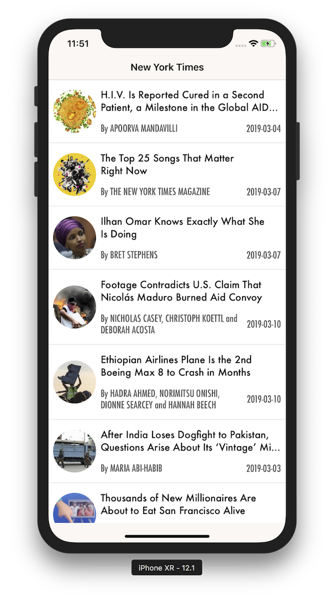
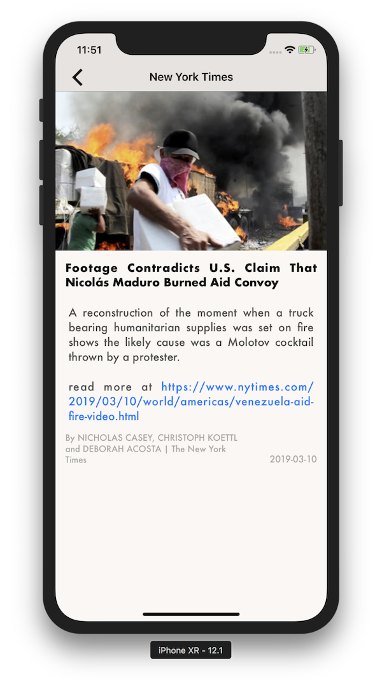

## Author:- Ankur Arya
email: <ankur.arya@me.com>

## Overview

This project contains two screens.
  - Article List Screen :- This screen shows a list of Articles which are fetched from server. User can also tap on Different part of Table Cell to see different details about it.
  - Article Details Screen :- This screen shows a number of detail related to Article such as Large Image, full title, abstract, and date

## Architecture

This project follows Clean Architecture.
  - Interactor: Retrieves Entities and contains the business logic for a particular use case. They are view agnostic and can be consumed by one or more Presenters.
  - Presenter: Handles preparing content for the display.
  - Domain Entity: Simple data model objects.
  - Router: Handles navigation logic for which screens should appear and when.

The project is segregated into three main layers.
  - Domain: This is the core of our application. It contains Entities and Interactors.
  - Presentation: It contains presenters, Presentation models and Model Converter.
  - Application: It contains Views, Router, Network Manager, and Utils.

## Get Started

This project uses CocoaPods for dependency management. Please open the .xcworkspace in Xcode 10.0 or above. It should work right out of the box.
However, if you face any issue in building or running the project please run pod install command.

## Dependencies

  - This sample app require minimum iOS 12 and Xcode 10 to run.
  - This project also uses RxSwift which is added as a pod using CocoaPods.

## Screenshots

